# Document details

  -----------------------------------------------------------------------
  Document version                    1.0
  ----------------------------------- -----------------------------------
  Date of last change                 27.04.2026

  Author                              Yury Butuzov
  -----------------------------------------------------------------------

# Introduction

This tool was created to save the time when you configure Maestro
environment in dual site HA configuration.

The questions that this tool can help reply to:

- which Site will be active in the moment when some component will fail;

- which weights do you need to set for the component if you want or not
  to fail over;

- how the configuration will work in different failure scenarios;

- show the customer the proper configuration for his case.

# Interface

Below is the explanation of the interface components.

## Settings

In this configuration window you can manage the weights that is used by
the tool. By default, the weights are complied with the Maestro default
settings values.

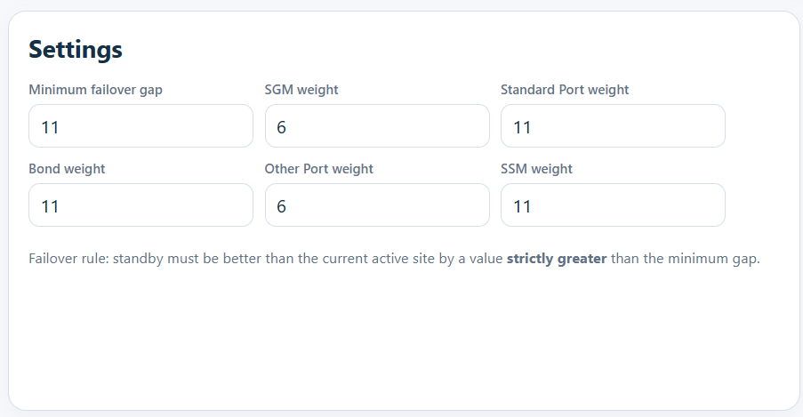{width="6.5in" height="3.3756944444444446in"}

## Scenario controls

With this configuration window you can create your own scenarios, change
or load existing and save the results to the external file.

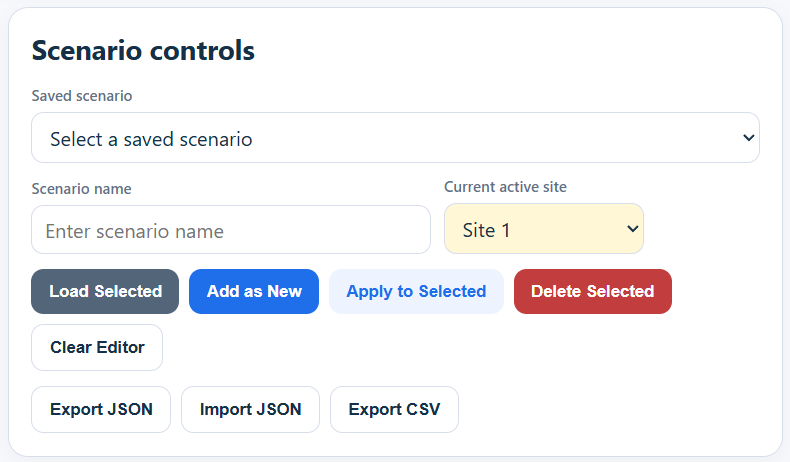{width="6.5in" height="3.8006944444444444in"}

## Calculator

In this configuration window you can manage the components that is used
in your scenario.

You can set the number of components that you have for each site and the
number of components that failed for specific scenario.

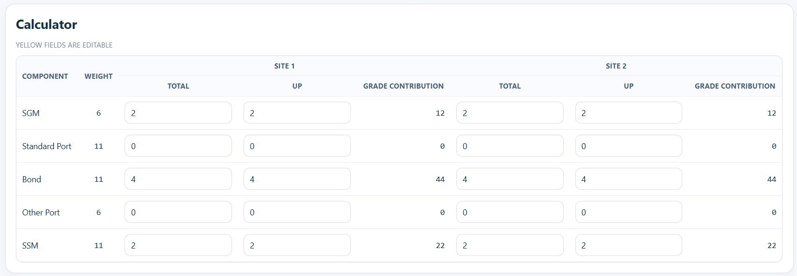{width="6.5in" height="2.2527777777777778in"}

## Information windows

On these windows you can see simple information and short description of
how to use the tool.

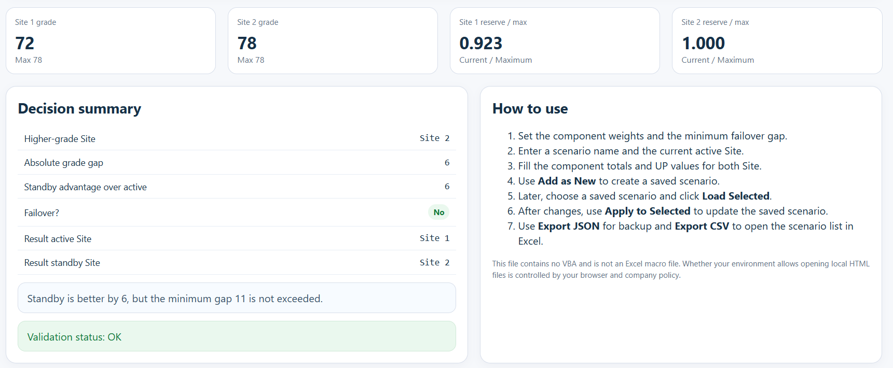{width="6.5in" height="2.68125in"}

## Scenario library

In this window you can understand how Maestro configuration will look in
different component failure scenarios. You can just change the weights
in the settings window, and every scenario will be recalculated.

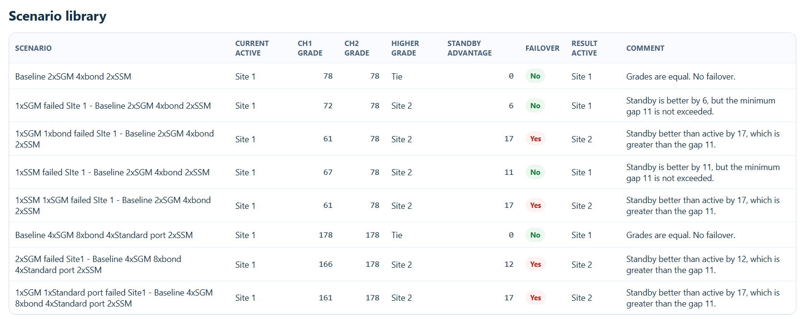{width="6.5in" height="2.578472222222222in"}

# Use case example

I want to create the baseline with 6 SGMs and 6 bonds and 4 Standard
ports with 2xSSM on each Site and 2 different failover scenarios.

1)  Create the scenario name in the Scenario controls:

*Baseline 6xSGM 6xbonds 4xStandard ports 2xSSM*

2)  Choose which Sile will be active -- Site 1

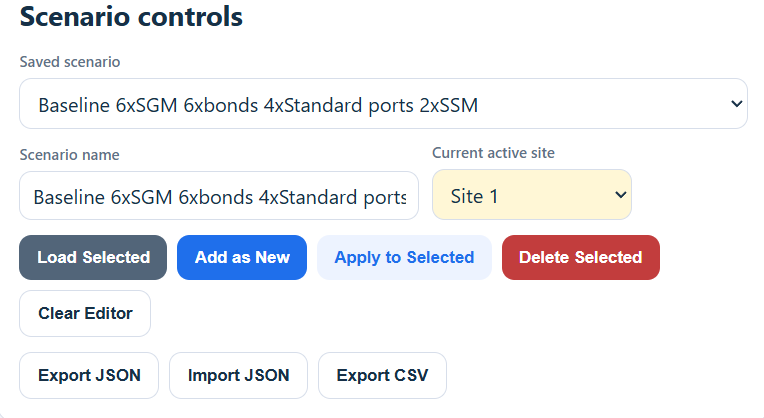{width="6.5in" height="3.55625in"}

3)  In the Calculator window set the correct amount of each component
    for each site

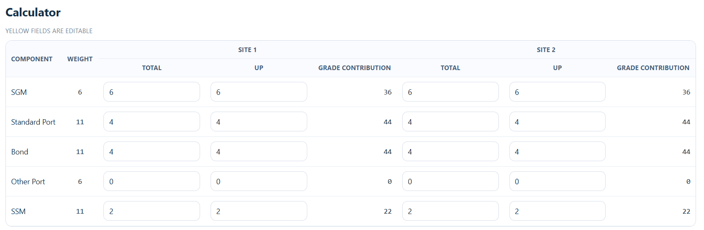{width="6.5in" height="2.126388888888889in"}

4)  Save the Baseline scenario -- *Add as New*

For already created baseline scenario I want to add scenario with 1xSGM
and 1xSSM failed on the Site 1

5)  Choose saved baseline scenario -- (*Baseline 6xSGM 6xbonds
    4xStandard ports 2xSSM)* and load it *(Load Selected)*

6)  Change the scenario name to (*1xSGM and 1xSSM failed - Baseline
    6xSGM 6xbonds 4xStandard ports 2xSSM)*

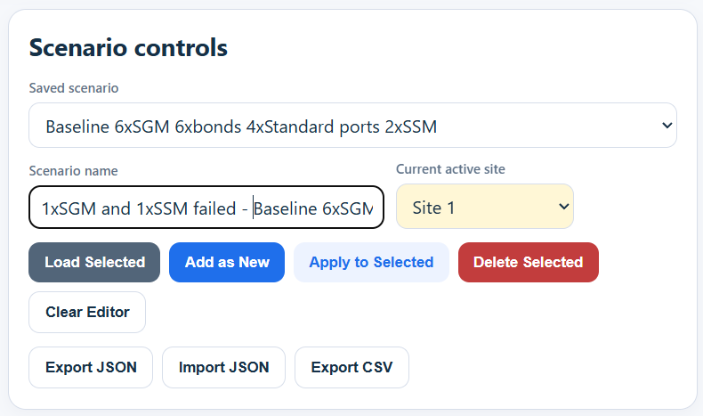{width="6.5in" height="3.842361111111111in"}

7)  Change the number of components that is in the UP state in the
    Calculator window

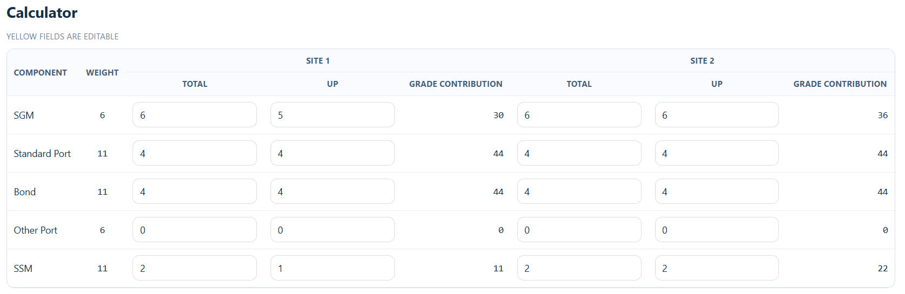{width="6.5in" height="2.1173611111111112in"}

8)  Save the scenario -- (*Add as New*)

9)  With the same manner I add another scenario for the case when --
    2xSGM 1xbond 1xSSM on Site1 and 1xSGM 1Standard port on Site 2
    failed

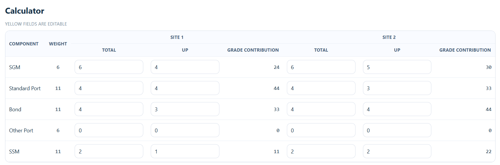{width="6.5in" height="2.157638888888889in"}

10) Now you have the scenario set and can play with the weights

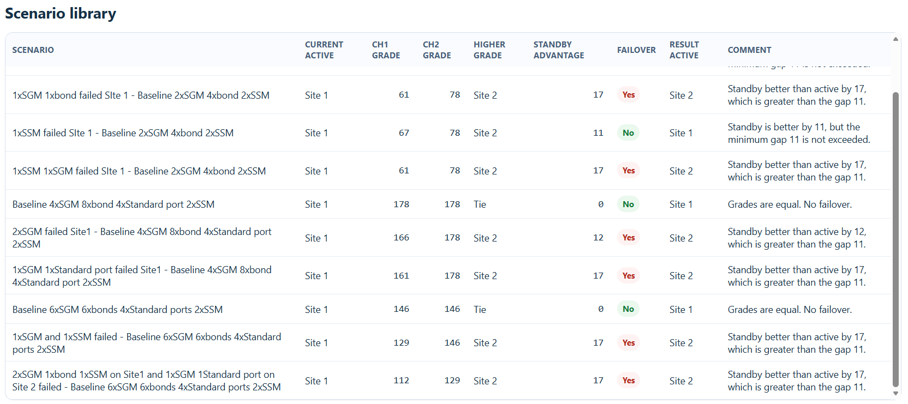{width="6.5in" height="2.8944444444444444in"}

11) For example, if I change the weight of bond from 11 to 4 my
    scenarios will look like this

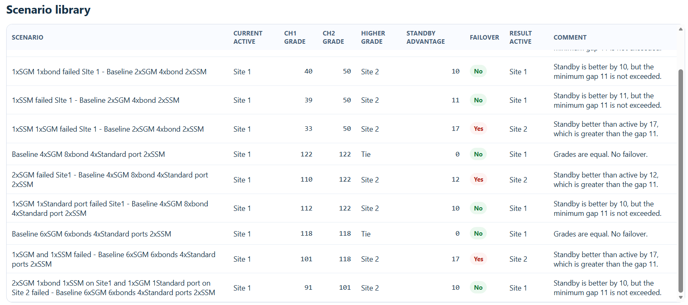{width="6.5in" height="2.8847222222222224in"}
